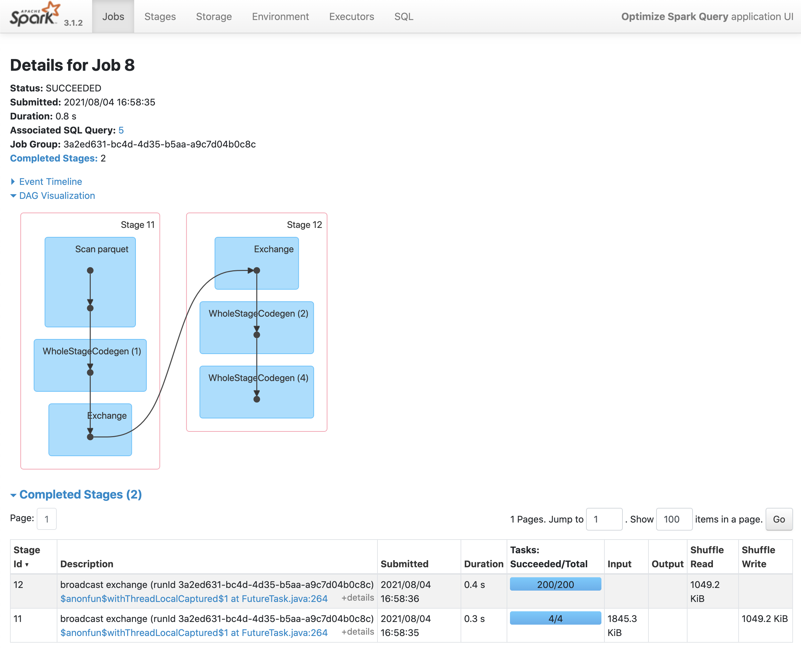

# spark-optimization
Optimizing a Spark SQL query

The ```data``` directory including ```answers``` and ```questions``` folders containing parquet files must first be loaded into HDFS.

As viewed within the Spark UI, the original Spark SQL query contained within this exercise results in a Spark job with 10 separate jobs.  
Among those jobs there are two seperate broadcast exchanges, the costliest parts of this query and that which can be further optimized.  


Shown below as Job ID 6 and Job ID 8:


Further inspecting one of the broadcast exchanges, Job ID 8, we can view the DAG visualization for each step within the job.  
We can see that stage ID 12 consists of 200 tasks. Each of these tasks represents a shuffle of data across partitions.  
This is the result of joining two DataFrames, and highlights the fact that Spark defaults to creating 200 partitions for the new DataFrame. 



Drilling down within the Spark UI reveals the 200 shuffle tasks performed in this join operation. 


In order to reduce the number of unnecessary shuffles and tasks involved in this job, we can use the .coalesce method on the newly created DataFrame.  
```answers_month = answers_month.coalesce(4)```

After coalescing the number of partitions created down to 4 (so as to match the number of partitions in our original DataFrames), we can see that the number of shuffles has been reduced to 4, correspoding to one shuffle per partition. 


Inspecting the tasks:

